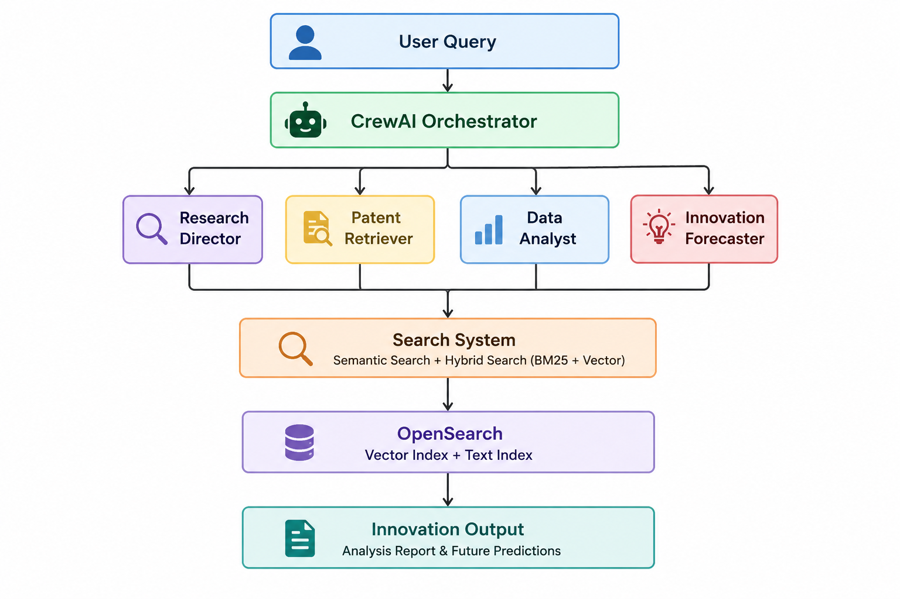

# 🔬 Patent Innovation Predictor

**Agentic AI · Patent Intelligence · Future Forecasting**

*Predict tomorrow's breakthroughs by learning from today's patents*

## ◈ What Is This?

**Patent Innovation Predictor** is a fully agentic AI pipeline that ingests patent data, understands it semantically, and forecasts **where technology is heading next** — all running locally on your machine.

It doesn't just search. It *thinks*. Four specialized AI agents collaborate: one directs research, one retrieves patents, one analyzes patterns, and one forecasts future innovations — all powered by local LLMs via Ollama and semantic vector search via OpenSearch.

> 💡 Current focus areas: **Lithium Battery Technology · Electric Vehicles · Renewable Energy · Emerging Innovation**

---

## ◈ Project Architecture

<p align="center">
  
</p>

---

## ◈ Tech Stack

| Layer | Technology | Purpose |
|---|---|---|
| 🤖 **Agent Framework** | [CrewAI](https://crewai.com) | Multi-agent orchestration & task chaining |
| 🧠 **LLM Runtime** | [Ollama](https://ollama.com) + DeepSeek-R1 1.5B | Local reasoning & inference |
| 🔢 **Embeddings** | `nomic-embed-text` via Ollama | Semantic vector generation (768-dim) |
| 🗄️ **Vector Database** | [OpenSearch](https://opensearch.org) | KNN search + BM25 hybrid retrieval |
| 🐳 **Containers** | Docker + Docker Compose | Isolated services for Ollama & OpenSearch |
| 🐍 **Language** | Python 3.10+ | Core backend, pipeline, agents |
| 🌐 **Patent Data API** | SerpAPI | Live patent data collection |
| 📦 **LangChain** | `langchain-ollama` | LLM abstraction & tool binding |

---

## ◈ Project Structure

```
PatentInnovationPredictor/
│
├── 📁 ProductAgent/              # Agent module definitions & intermediate outputs
│
├── 📁 results/                   # Generated prediction reports (JSON + text)
│
├── 🔧 .env                       # API keys & environment config (never commit!)
│
├── 🚀 agentic_rag.py             # ← MAIN ENTRY POINT — runs the full pipeline
│
├── 🐳 docker-compose.yml         # Spins up OpenSearch + Dashboards containers
│
├── 🔢 embedding.py               # Generates 768-dim vectors via nomic-embed-text
│
├── 🛠️ helper.py                  # Shared utilities: logging, file I/O, text processing
│
├── 📥 information_collector.py   # Fetches & normalizes patent data from SerpAPI/CSV
│
├── 📤 ingestion.py               # Embeds patents & bulk-indexes them into OpenSearch
│
├── 🔌 opensearch_client.py       # OpenSearch connection, index creation & KNN mapping
│
├── 🤝 patent_crew.py             # CrewAI agents, tasks & crew assembly
│
├── 🔍 patent_search_tools.py     # Semantic, hybrid & iterative search tool definitions
│
└── 📦 requirements.txt           # Python dependencies
```

---

## ◈ Prerequisites

Before you begin, ensure the following are installed:

- **[Python 3.10+](https://python.org/downloads)** — Core runtime
- **[Docker Desktop](https://docs.docker.com/get-docker/)** — For Ollama & OpenSearch containers
- **[Git](https://git-scm.com)** — To clone the repo

---

## ◈ Quick Start

### 1 · Clone & Set Up Environment

```bash
git clone https://github.com/your-username/patent-innovation-predictor.git
cd patent-innovation-predictor

# Create and activate virtual environment
python -m venv ProductAgent

# Acivate venv Windows(Powershell):
    ProductAgent\Scripts\activate

# Install dependencies
pip install -r requirements.txt
```

---

### Step 2 — Start OpenSearch (Vector Database)
 
OpenSearch stores and searches your patent embeddings. Start it via Docker Compose:
 
```bash
# Start OpenSearch + OpenSearch Dashboards
docker compose -f docker-compose.yml up -d
 
# Verify OpenSearch is running (should return cluster info JSON)
curl http://localhost:9200
 
# Or in PowerShell:
Invoke-RestMethod -Uri "http://localhost:9200"
```
 
> **OpenSearch Dashboard UI** → http://localhost:5601  
> **OpenSearch API** → http://localhost:9200
 
---
 
### Step 3 — Start Ollama (Local LLM + Embedding Model)
 
Ollama runs the LLM for agent reasoning AND generates embeddings for semantic search.
 
```bash
# Pull and run the Ollama container
docker run -d \
  -v ollama:/root/.ollama \
  -p 11434:11434 \
  --name ollama \
  ollama/ollama
```
 
**Pull required models inside the container:**
 
```bash
# Embedding model (REQUIRED — used by ingestion.py and patent_search_tools.py)
docker exec -it ollama ollama pull nomic-embed-text
 
# Reasoning model — choose one:
docker exec -it ollama ollama pull deepseek-r1:1.5b   # Lightweight, fast (default)
docker exec -it ollama ollama pull llama3             # More reliable for tool-use
docker exec -it ollama ollama pull llama3.1           # Best quality (recommended)
```
 
**Verify models are available:**
 
```bash
docker exec -it ollama ollama list
```
 
Expected output:
```
NAME                       ID              SIZE    MODIFIED
nomic-embed-text:latest    0a109f422b47    274 MB  ...
deepseek-r1:1.5b           a42b25d8c10a    1.1 GB  ...
llama3:latest              365c0bd3c000    4.7 GB  ...
```
 
**Verify the embedding model works (PowerShell):**
 
```powershell
Invoke-RestMethod -Uri "http://localhost:11434/api/embeddings" `
  -Method Post `
  -ContentType "application/json" `
  -Body '{
    "model": "nomic-embed-text",
    "prompt": "The sky is blue because of Rayleigh scattering"
  }'
```
 
You should receive a JSON response with a `"embedding"` array of 768 floats.
 
**Verify the embedding model works (Linux/macOS):**
 
```bash
curl -s http://localhost:11434/api/embeddings \
  -d '{"model": "nomic-embed-text", "prompt": "test"}' | head -c 200
```
 
---
### 4 · Configure Environment

```bash
# Create your .env file
cp .env.example .env
```

```env
# .env
SERPAPI_API_KEY=your_serpapi_key_here      # Optional: for live patent fetching
```

---

### 5 · Ingest Patent Data

```bash
# Collect & index patents into OpenSearch
python ingestion.py
```

---

### 6 · Run the Predictor

```bash
python agentic_rag.py
```

You'll see an interactive menu:
 
```
============================================================
  PATENT INNOVATION PREDICTOR
============================================================
1. Run complete patent trend analysis and forecasting
2. Search for specific patents
3. Iterative patent exploration
4. View system status
5. Exit
------------------------------------------------------------
Select an option (1-5):
```
 
**When prompted:**
- **Research area:** e.g. `Lithium Battery`, `Electric Vehicles`, `Solar Cell`
- **Model name:** e.g. `deepseek-r1:1.5b`, `llama3`, `llama3.1`
Results are saved to: `patent_analysis_YYYYMMDD_HHMMSS.txt`
 
---
 
## ◈ Running All Three Terminals (Recommended Workflow)
 
For the smoothest experience, keep these terminals open simultaneously:
 
```
Terminal 1 — OpenSearch (keep running)
────────────────────────────────────────
docker compose -f docker-compose.yml up
 
Terminal 2 — Main app
────────────────────────────────────────
python agentic_rag.py
 
Terminal 3 — Pull/manage Ollama models (as needed)
────────────────────────────────────────
docker exec -it ollama ollama pull llama3.1
docker exec -it ollama ollama list
```
 
---
 
## ◈ Choosing a Model
 
| Model | Size | Tool-Use Quality | Speed | Recommended For |
|---|---|---|---|---|
| `deepseek-r1:1.5b` | 1.1 GB | ⚠️ Limited | ⚡ Fastest | Quick tests only |
| `llama3:latest` | 4.7 GB | ✅ Good | Fast | General use |
| `llama3.1:latest` | 4.7 GB | ✅✅ Better | Fast | **Recommended** |
| `mistral:latest` | 4.1 GB | ✅✅ Better | Fast | Alternative to llama3.1 |
 
> **Note:** `deepseek-r1:1.5b` is too small for reliable multi-step tool-use in CrewAI agents. Use at least `llama3` (8B) for production runs. The 1.5b model may fail with `LLM Failed` errors after tool calls.
 
---
 
## ◈ Example Output
 
```
╔══════════════════════════════════════════════════════╗
║        PATENT INNOVATION PREDICTION REPORT           ║
╠══════════════════════════════════════════════════════╣
║  Research Area : Lithium Battery Technology          ║
║  Generated     : 2026-05-20 22:51 UTC                ║
║  Patents Found : 30 (2023-05-20 → 2026-05-20)        ║
╠══════════════════════════════════════════════════════╣
║  Trend Analysis:                                     ║
║  · Solid-state electrolyte patents up 38% YoY        ║
║  · Silicon-anode designs overtaking graphite         ║
║  · BMS (Battery Mgmt Systems) AI integration surge   ║
╠══════════════════════════════════════════════════════╣
║  Future Innovation Predictions (2026–2028):          ║
║                                                      ║
║  1. Solid-state batteries will dominate EV OEM       ║
║     patent filings, driven by Toyota & Samsung.      ║
║                                                      ║
║  2. AI-powered real-time charging optimisation       ║
║     will become the dominant BMS architecture.       ║
║                                                      ║
║  3. Sustainable battery recycling & second-life      ║
║     applications will see rapid patent growth.       ║
║                                                      ║
║  4. Silicon-anode hybrid cells will replace          ║
║     graphite-based designs by 2026–2027.             ║
╚══════════════════════════════════════════════════════╝
```
 
---
 
## ◈ Troubleshooting
 
### `LLM Failed` after a tool call
 
The LLM is too small to process the tool output and produce a `Final Answer`. Fix:
 
```bash
# Switch to a larger model
docker exec -it ollama ollama pull llama3.1
# Then re-run and enter: llama3.1 when prompted for model name
```
 
### OpenSearch connection refused
 
```bash
# Check containers are running
docker ps
 
# Restart if needed
docker compose -f docker-compose.yml down
docker compose -f docker-compose.yml up -d
 
# Wait ~30s then verify
curl http://localhost:9200
```
 
### Embedding errors / nomic-embed-text not found
 
```bash
# Confirm the model is present in Ollama
docker exec -it ollama ollama list
 
# Re-pull if missing
docker exec -it ollama ollama pull nomic-embed-text
```
 
### `No patents found` after ingestion
 
```bash
# Re-run ingestion to make sure data is indexed
python ingestion.py
 
# Then test retrieval directly
python patent_search_tools.py
```
 
### Windows PowerShell execution policy error
 
```powershell
Set-ExecutionPolicy -ExecutionPolicy RemoteSigned -Scope CurrentUser
```
 
---
 
## ◈ How It Works — Agent Pipeline
 
```
Task 1 (Research Director)
  └─ No tools needed
  └─ Output: bullet-point research plan
 
Task 2 (Patent Retriever)
  └─ Calls: search_patents_by_date_range(query, start_date, end_date, top_k=10)
  └─ Output: structured list of patents grouped by sub-technology
 
Task 3 (Data Analyst)
  └─ Calls: analyze_patent_trends(patents_data)  [optional]
  └─ Output: trend report — growing areas, key companies, timelines
 
Task 4 (Innovation Forecaster)
  └─ No tools needed
  └─ Output: 2–3 year innovation forecast with R&D recommendations
```

All tasks run **sequentially** — each agent receives the previous agent's output as context.

---


## ◈ License
 
MIT License — see `LICENSE` for details.